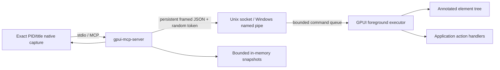

# gpui-mcp

`gpui-mcp` is an embedded, cross-platform Model Context Protocol bridge for testing and automating [GPUI](https://github.com/zed-industries/zed/tree/main/crates/gpui) applications. It follows the intent of [`dijdzv/egui-mcp`](https://github.com/dijdzv/egui-mcp)—semantic UI inspection, input, screenshots, waits, snapshots, performance data, and logs—without depending on Linux AT-SPI.

The current dependency baseline is GPUI **0.2.2**, the official Rust MCP SDK (`rmcp`) **2.2.0**, and XCap **0.9.6**. Cargo.lock retains the exact transitive dependency set.

## Why it is embedded

The released GPUI 0.2.2 crate does not expose a cross-platform accessibility tree. GPUI's main branch merged an AccessKit foundation after that release, but application-level coverage is still being rolled out and the API is not yet available from the latest crates.io release. This project therefore keeps its own semantic source while making its roles, states, actions, and stable IDs straightforward to adapt to the upstream accessibility tree when it ships. The application explicitly annotates ordinary GPUI elements:

- the wrapper records actual logical bounds after GPUI layout;
- the application supplies stable IDs, roles, labels, state, text/value metadata, and redaction;
- keyboard input runs through GPUI's public keystroke API;
- semantic operations invoke the exact application-provided handler by stable ID and tree generation on GPUI's foreground executor;
- synthetic native pointer input constructs GPUI `PlatformInput` in-process and calls `Window::dispatch_event`, the same window-relative logical-pixel pipeline used by every OS backend;
- deferred GPUI elements and overlays are included before each semantic frame is published;
- screenshots run in the separate MCP server process and require both the application's PID and exact native window title, never an arbitrary window;
- the MCP process and application communicate over owner-restricted native local IPC.



## Platform support

| Platform | Semantic actions | Synthetic native pointer | Keyboard | Screenshots |
|---|---:|---:|---:|---:|
| Windows 11 | Yes | Yes, in-process GPUI | Yes | XCap/Windows Graphics Capture |
| macOS | Yes | Yes, in-process GPUI | Yes | XCap/ScreenCaptureKit; Screen Recording permission may be required |
| Linux X11 | Yes | Yes, in-process GPUI | Yes | XCap/X11 |
| Linux Wayland | Yes | Yes, in-process GPUI | Yes | XCap through the desktop portal/PipeWire; compositor support and user approval vary |

Semantic inspection and GPUI-thread actions do not require OS accessibility privileges. Native screenshot constraints do not disable the rest of the tool suite. Capture runs in the separate server process because Windows window enumeration intentionally excludes windows owned by the enumerating process. Build `gpui-mcp` with `default-features = false` when an application should expose no screenshot capability; the server enforces that advertised capability before capture.

## Quick start

Build the MCP server and run the instrumented demo:

```console
cargo build --release -p gpui-mcp-server
cargo run -p gpui-mcp-demo
```

The demo prints its private endpoint descriptor path to stderr. Start the MCP server with either the application ID or that exact path:

```console
target/release/gpui-mcp-server --app-id gpui-mcp-demo
target/release/gpui-mcp-server --endpoint /path/printed/by/the/demo.json
```

Recording artifacts are confined to a server-owned directory. By default it is
an app/process-specific directory below the user's runtime area (falling back to
the process temp area). Override it only as server configuration, never through
a tool call:

```console
target/release/gpui-mcp-server --app-id gpui-mcp-demo --artifact-dir /private/test-artifacts
```

On Windows, `--capture-stability-deadline-ms` configures the bounded Graphics Capture
freshness deadline from 32 through 2000 milliseconds (default 1000). The backend
returns the newest of three ordered native samples, which avoids stale startup
frames without rejecting animated content. Other capture backends currently
perform one native capture and ignore this Windows-specific deadline.

A generic MCP client configuration looks like:

```json
{
  "mcpServers": {
    "gpui": {
      "command": "/absolute/path/to/gpui-mcp-server",
      "args": ["--app-id", "my-gpui-app"]
    }
  }
}
```

When several matching windows are running, use `--endpoint` to avoid ambiguity.

For first-party dogfooding and CI scripts, build the companion MCP client as
well. A plain `--tool` invocation is intentionally one-shot: it starts the stdio
server, performs the normal MCP initialize handshake, invokes one tool, and
exits. It does not bypass the MCP transport or call the embedded bridge directly:

```console
cargo build -p gpui-mcp-server --bins
target/debug/gpui-mcp-call --server target/debug/gpui-mcp-server --app-id gpui-mcp-demo --list-tools
target/debug/gpui-mcp-call --server target/debug/gpui-mcp-server --app-id gpui-mcp-demo --tool click_element --arguments '{"id":"save"}'
target/debug/gpui-mcp-call --server target/debug/gpui-mcp-server --app-id gpui-mcp-demo --tool screenshot --image-out target/demo.png
```

Video recording state lives in the MCP server process, so `start_video_recording` and
`stop_video_recording` must use one persistent MCP transport. Continuous mode is the
default: it requests settled GPUI render frames at a bounded cadence, like a browser
screencast. `capture_video_frame` remains an optional explicit checkpoint. Do not issue
these calls as separate one-shot commands. `gpui-mcp-call
--batch` keeps one initialized transport alive for an ordered JSON array of up
to 256 calls:

```json
[
  {"tool":"start_video_recording","arguments":{"include_pointer":true,"frames_per_second":10}},
  {"tool":"pointer_move","arguments":{"x":400,"y":300}},
  {"tool":"pointer_click","arguments":{"x":400,"y":300}},
  {"tool":"capture_video_frame"},
  {"tool":"stop_video_recording","arguments":{"artifact_name":"save-flow.mp4"}}
]
```

```console
target/debug/gpui-mcp-call --server target/debug/gpui-mcp-server --app-id gpui-mcp-demo --batch recording.json
```

A normal long-lived MCP client may call the same tools interactively. Use
`--endpoint` instead of `--app-id` when more than one matching app is open.
`start_video_recording` returns a monotonically increasing server-process session ID;
each checkpoint and the final artifact report that same ID. The server binds in-flight
capture and encoding work to that session internally, rejects overlaps, reports dropped
continuous frames, releases a capture reservation if its request fails or is cancelled,
and restores captured frames when encoding fails so `stop_video_recording` can be retried.

## Instrument a GPUI application

Add the integration crate and retain one `BridgeHandle` for the lifetime of each automated window:

```toml
[dependencies]
gpui = "0.2.2"
gpui-mcp = { path = "crates/gpui-mcp" }

[patch.crates-io]
# Required until GPUI publishes DispatchEventResult publicly; adjust this path when vendored elsewhere.
gpui = { path = "vendor/gpui" }
```

Install it while constructing the window root:

```rust,ignore
window.set_window_title("My App");
let bridge = BridgeHandle::install(
    window,
    cx,
    BridgeConfig::new("my-app", "My App", "My App"),
)?;
let automation = bridge.automation();
// Store both `bridge` and `automation` in the root view.
```

Wrap the complete rendered hierarchy in exactly one root annotation and annotate useful descendants:

```rust,ignore
let automation = self.automation.clone();

div()
    .child(
        div()
            .child("Save")
            .on_click(cx.listener(|this, _, _, cx| this.save(cx)))
            .mcp_node(
                &automation,
                NodeSpec::new("save", Role::Button)
                    .label("Save document")
                    .action(NodeAction::Click)
                    .on_event(cx.listener(|this, event, _, cx| {
                        if matches!(event, NodeEvent::Click { .. }) {
                            this.save(cx);
                        }
                    })),
            ),
    )
    .mcp_node(
        &automation,
        NodeSpec::new("app", Role::Application)
            .label("My App")
            .root(),
    )
```

`NodeSpec::on_event` is required for semantic automation. Advertise only the actions the callback actually handles: `Click`, `Focus`, `Hover`, `Drag`, `Scroll`, `SetText`, and `SetValue` are distinct events. The callback is retained only on the GPUI thread and can safely capture GPUI listener/entity handles. The callback is never serialized or sent to the IPC thread. `NodeSpec::on_event_result` can explicitly reject an action with a bounded, non-secret reason. Prefer weak entity handles for longer-lived closures.

Custom editors and value controls should advertise `NodeAction::SetText` or
`NodeAction::SetValue` and handle the corresponding `NodeEvent`. This routes
validated mutations directly to application logic instead of relying on
platform-specific pointer or keyboard emulation.

Applications must not publish passwords, access tokens, or other secrets through `TextInfo`, `ValueInfo`, metadata, or logs. Use `TextInfo { redacted: true, text: String::new(), .. }` for secret fields.

See [`examples/demo/src/main.rs`](examples/demo/src/main.rs) for a complete integration.

## Pure HTML applications and visual-builder documents

The `gpui-mcp-html` crate reuses the
[`htmlswap`](https://github.com/themixednuts/htmlswap) parser and target-neutral render plan, but
selects a fail-closed **pure HTML** source policy. Application documents contain
ordinary HTML and local CSS only: `data-htmlswap-*`, scripts, inline event
attributes, JavaScript URLs, embedded browsing contexts, and remote resources
are rejected before a render plan can be used. The integration disables
htmlswap's file and network resolvers, so stylesheets enter only through the
host's explicit asset API.

Behavior lives beside the HTML in a versioned RON document. Targets are exact
HTML IDs—never selectors—and symbols resolve only to Rust callbacks explicitly
registered by the application:

```ron
(
    version: 1,
    bindings: [
        Event(
            target: Id("save"),
            event: Click,
            handler: "save_document",
        ),
        Property(
            target: Id("title"),
            property: Value,
            source: "document_title",
            mode: TwoWay,
        ),
    ],
)
```

`BindingDocument` supports RON for human-authored project files and JSON for
programmatic interchange. MCP itself remains JSON-RPC, as required by the MCP
transport. Both encodings deserialize into the same validated Rust types.

`HtmlUi` compiles HTML/CSS, resolves every binding, and rejects duplicate,
missing, incompatible, or renderer-reserved IDs. `HookRegistry` connects event
and state symbols to foreground-thread application logic. `LiveHtml` renders
the plan and publishes the same stable semantic nodes to MCP. Standard elements
work directly; application widgets use normal hyphenated custom elements such
as `<document-card>` and a `ComponentRegistry` Rust factory—no private source
attributes are needed.

The native text-input backend uses `gpui-component`, whose window contract
requires its `Root` wrapper. HTML-backed applications should return
`gpui_mcp_html::NativeRoot::new(view, window, cx)` from the window constructor;
the scaffold below generates that wrapper automatically. This is required for
portable focus, text editing, clipboard, and keyboard behavior—not only for MCP
automation.

Create a standalone starter project with:

```console
cargo run -p gpui-mcp-html --bin gpui-mcp -- new my-app
```

The scaffold writes `ui/app.html`, `ui/app.css`, `ui/app.bindings.ron`, and the
Rust hook/bridge shell atomically without overwriting an existing destination.
By default its Cargo manifest uses this public repository's `main` branch; pass
`--gpui-mcp-workspace <path>` for an explicit local/offline source checkout.
Generated apps watch those three files with the platform-native backend and
atomically hot reload valid bundles without recompiling Rust. They also opt into
revisioned, in-memory MCP preview; invalid edits return diagnostics while the
last-good native UI remains active.
See [`docs/visual-builder.md`](docs/visual-builder.md) for the complete document
shape, live-hook integration, component contract, and builder boundaries. See
[`docs/gpui-studio.md`](docs/gpui-studio.md) for the proposed native visual
builder product, transaction model, UX, and delivery sequence.

[`examples/runtime-showcase`](examples/runtime-showcase) is a standalone app
created through that scaffold flow. It demonstrates nested grid/flex layout,
hover and focus styles, a disclosure menu, and Rust-backed live state:

```console
cargo run --manifest-path examples/runtime-showcase/Cargo.toml
```

## Semantic input versus synthetic native input

The existing pointer tools (`click_element`, `drag_element`, `scroll`, and their coordinate forms) are **semantic**: they select an annotated node and invoke its application-provided `NodeSpec::on_event` handler directly. They are the best choice for stable intent-level automation, work even when a visual target is occluded, and deliberately do not run GPUI hitboxes, `on_mouse_down`, `on_drag`, `on_drop`, or native wheel listeners.

The `native_*` tools drive the **real GPUI pointer pipeline**. The bridge constructs `PlatformInput::MouseDown`, `MouseMove`, `MouseUp`, and `ScrollWheel` values on the GPUI foreground executor and passes them to `Window::dispatch_event`, exactly where the OS platform layer enters GPUI. This updates `window.mouse_position()`, performs normal rendered-frame hit testing, crosses GPUI's drag threshold, starts the active drag, and delivers drop and wheel handlers. Element-addressed tools resolve the node's current logical bounds center; coordinate tools use window-relative logical pixels.

This mechanism is OS-agnostic by construction: it does not move the real cursor, synthesize operating-system events, require focus or accessibility permission, depend on screen position or DPI conversion, or use platform crates. Compound clicks and drags send one native event per bridge operation and settle GPUI frames between events without sleeping, so slow machines observe the same deterministic sequence.

GPUI 0.2.2 publishes `Window::dispatch_event` but accidentally leaves its return type crate-private. The workspace therefore carries an otherwise unchanged `vendor/gpui` 0.2.2 patch that makes only `DispatchEventResult` public, allowing the published method to be called safely without changing input behavior.

Example native calls:

```console
target/debug/gpui-mcp-call --server target/debug/gpui-mcp-server --app-id gpui-mcp-demo --tool pointer_move --arguments '{"x":400,"y":300}'
target/debug/gpui-mcp-call --server target/debug/gpui-mcp-server --app-id gpui-mcp-demo --tool pointer_click --arguments '{"x":400,"y":300}'
target/debug/gpui-mcp-call --server target/debug/gpui-mcp-server --app-id gpui-mcp-demo --tool pointer_drag --arguments '{"from_x":400,"from_y":300,"to_x":600,"to_y":400,"steps":12}'
```

## MCP tools

The stdio server currently exposes:

- Connectivity: `ping`, `check_connection`
- Tree and search: `get_ui_tree`, `find_elements`, `get_element`, `get_element_bounds`
- Semantic pointer actions (direct annotated handlers): `click_element`, `double_click_element`, `click_coordinates`, `hover_element`, `drag_element`, `drag_coordinates`, `focus_element`, `scroll`
- Portable native pointer pipeline: `pointer_location`, `pointer_move`, `pointer_down`, `pointer_up`, `pointer_click`, `pointer_drag`, `pointer_scroll`. These use in-process GPUI pointer state, hit testing, drag/drop, and wheel handling on Windows, Linux, and macOS; they do not inspect or move the global OS cursor. Legacy `native_*` tools remain for element-targeted calls.
- Keyboard, text, and values: `keyboard`, `type_text`, `get_text_info`, `set_text`, `get_value`, `set_value`, `get_selection_count`
- State and synchronization: `get_element_state`, `wait_for_element`, `wait_for_state`
- Screenshots: `screenshot`, `screenshot_region`, `screenshot_element`, `capture_screenshot_snapshot`, `compare_screenshots`, `diff_screenshots`
- H.264/MP4 screencast video: `start_video_recording` (continuous by default), `capture_video_frame` (optional checkpoint), `stop_video_recording`
- Visual diagnostics: `highlight_elements`, `clear_highlights`
- UI snapshots: `save_ui_snapshot`, `load_ui_snapshot`, `diff_ui_snapshots`, `diff_current_ui`
- Performance and logs: `get_frame_stats`, `record_performance`, `get_performance_report`, `get_logs`, `clear_logs`
- Opt-in live building: `get_live_document`, `preview_live_document`

Applications may also opt into standard MCP `resources/list` and
`resources/read` through `BridgeConfig::enable_context_resources` and a single
foreground-thread handler. This is intended for application-owned model context
such as a visual builder's current selection, project manifest, and spatial
review comments. The generic bridge validates exact URIs, unique descriptors,
MIME metadata, declared sizes, resource count, and text size; it never grants
filesystem access.

Screenshots, snapshots, and live-document previews are in-memory only. Tool
inputs cannot read or write arbitrary filesystem paths. `stop_video_recording`
accepts only one validated portable `.mp4` artifact name and writes below the
server-configured artifact directory. It rejects traversal, separators,
symlinks, and non-regular targets; overwrite is opt-in. MP4 bytes are flushed
and synchronized to a same-directory temporary regular file before an atomic
rename. Live preview uses a complete HTML/CSS/RON bundle plus
`expected_revision`; it never applies a partial or stale update.

Element actions are resolved by stable ID against the tree generation the MCP server inspected. If the UI changes before dispatch, the bridge returns `StaleGeneration`; it never falls back to coordinates. Wait tools hold a persistent connection and subscribe to semantic generation changes rather than polling the full tree. `get_ui_tree` also returns bounded diagnostics for invalid nodes, duplicate IDs, missing parents, parent cycles, and capacity overflow.

Frame metrics are deliberately named by what they measure: frame interval is the time between semantic-root prepaint starts, prepaint covers the root through deferred prepaint, and root paint covers the annotated root subtree. They are observations of the instrumented root, not GPU-present or compositor timings.

## Security model

This bridge can control the instrumented application. Enable it only in development, test, or explicitly authorized automation builds.

Hardening controls include:

- filesystem Unix-domain sockets inside a mode `0700` directory, created mode `0600`, with peer effective-user verification on Linux and macOS;
- local Windows named pipes with a protected owner/LocalSystem DACL;
- random 256-bit per-window token compared in constant time;
- descriptor stored in the user's runtime/local-data directory, atomically written, and mode `0600` inside a `0700` directory on Unix;
- protocol-version and request-correlation checks, generation-checked semantic mutation, explicit action outcomes, and persistent connection bounds;
- validated application IDs and snapshot names, preventing traversal;
- 1 MiB request and 24 MiB response limits, 768 KiB live-source, 256 KiB per context resource, 64-resource, and 16 MiB PNG limits, bounded node/log/snapshot/diagnostic stores, bounded command and connection counts;
- recording caps for target cadence (1–30 FPS), frame count, dimensions, aggregate stored base64 bytes, aggregate decoded pixels, repeated capture failures, and a 32 MiB H.264/MP4 output, with all decode/encode/filesystem work off the async executor;
- read, write, UI-operation, wait, native-capture freshness, encoding-response, and connect deadlines;
- all state-changing UI work runs on GPUI's foreground executor;
- no stdout logging, because stdout is reserved for MCP stdio;
- no arbitrary host/window capture: PID and exact native title must both match;
- explicit shutdown and descriptor ownership checks during cleanup;
- `unsafe_code = "forbid"` and workspace-wide strict Clippy policy.

The OS endpoint permissions are the first boundary; the per-window token is defense in depth. A process already running as the same OS user and able to read that user's private files remains outside this threat model. See [`SECURITY.md`](SECURITY.md) for reporting and deployment guidance.

## Linux build dependencies

GPUI and native screenshots use system graphics/session libraries. Ubuntu CI installs:

```console
sudo apt-get install clang libclang-dev pkg-config cmake \
  libfontconfig-dev libwayland-dev libxkbcommon-dev libxkbcommon-x11-dev \
  libxrandr-dev libegl-dev \
  libx11-xcb-dev libxcb1-dev libxcb-render0-dev libxcb-shape0-dev \
  libxcb-xfixes0-dev libxcb-randr0-dev libxcb-shm0-dev libxcb-xinput-dev \
  libxcb-composite0-dev libpipewire-0.3-dev libdbus-1-dev libegl1-mesa-dev
```

Exact package names differ between distributions.

## Development

```console
cargo fmt --all -- --check
cargo test -p gpui-mcp-html --test runtime --no-default-features --features json,ron -j 1
cargo test --workspace --all-features
cargo clippy --workspace --all-targets --all-features -- -D warnings
cargo audit
```

### Chromium/GPUI visual parity

The visual parity harness renders a suite of pure documents twice: Playwright
loads each one in its version-matched Chromium, while `gpui-mcp-html-visual`
compiles the same bytes through htmlswap and paints them in a real frameless
GPUI window. The suite covers the reference frame, deeply nested flex and grid,
baseline interaction layout, hover, keyboard focus, and an opened standard
`<details>` dropdown. State-specific solid-color probes ensure an interaction
cannot pass by accidentally leaving both screenshots unchanged.

The native helper captures only the exact fixture PID/title through XCap. It
removes a small platform window frame by cropping or padding, never by
resampling, and preserves the native display scale for high-density Windows and
macOS displays. Playwright renders at that same scale before Pixelmatch compares
the images.

```console
npm ci --ignore-scripts
npm run install:chromium
npm run test:visual
```

Linux needs an active X11 display; CI runs the command through
`xvfb-run -a`. macOS may request Screen Recording permission for native window
capture. The run writes the Chromium reference, normalized and raw GPUI
captures, a heatmap, and `metrics.json` under `visual-tests/artifacts`. It gates
both perceptual changed-pixel ratio and normalized mean absolute channel error,
so broad low-contrast drift cannot hide behind the antialiasing tolerance.

The focused runtime test opens a real GPUI test window, renders pure HTML/CSS,
captures its MCP semantic tree and layout bounds, resolves a custom element,
dispatches click/text/checkbox actions, verifies two-way state and rerendering,
and checks password redaction. It is the fastest regression loop when changing
htmlswap lowering or `gpui-mcp-html` resolvers. `-j 1` avoids an MSVC PDB name
collision between the test-support and CLI feature variants on Windows.

CI runs code checks and the Chromium/GPUI parity test on Windows, Ubuntu/Xvfb,
and macOS. GPUI is actively developed and pre-1.0, so review its release notes
before dependency upgrades.

## License

Apache-2.0.
