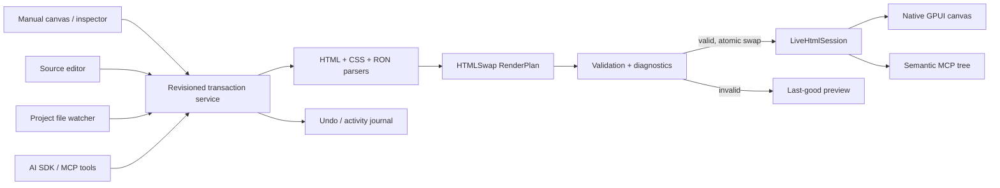

# gpui-studio product and architecture

`gpui-studio` is a native GPUI visual builder whose canvas is the real
HTMLSwap-to-GPUI runtime. It is not a web editor that later attempts to export
something similar. Manual edits, drag/drop operations, source edits, filesystem
changes, and AI/MCP edits all enter the same revisioned document pipeline and
produce the same native preview.

## Product thesis

The durable product is a normal project, not a Studio database:

```text
my-app/
  ui/
    app.html
    app.css
    app.bindings.ron
  src/
    main.rs
  .gpui-studio/
    workspace.ron        # optional editor layout, breakpoints, guides, recent selections
```

HTML owns structure and semantics, CSS owns presentation, and RON names exact
connections to application-owned Rust hooks. `.gpui-studio/workspace.ron` may
store editor-only preferences, but must never be required to render the app.
MCP stays JSON-RPC because that is the transport; it carries the same complete
HTML/CSS/RON bundle used by the manual editor.

The first release should intentionally support one `app.*` document. A later
multi-page/component layout can expand to `ui/pages/`, `ui/components/`, and
shared `tokens.css` without changing the underlying document types.

## Interaction model

Studio should feel like a technical drafting table: warm graphite chrome, a
neutral canvas, precise one-pixel separators, high-contrast type, and restrained
status colors. The UI should privilege the work instead of presenting a large
chat surface.

```text
┌ Project / Components ┬──────── Native GPUI canvas ────────┬ Inspector ┐
│ pages                │ rulers, breakpoints, zoom          │ layout    │
│ outline              │ selection + flex/grid overlays     │ style     │
│ assets               │ real hover/focus/active states     │ semantics │
│ registered widgets   │                                    │ bindings  │
├──────────────────────┴────────────────────────────────────┴───────────┤
│ Problems │ Runtime state │ MCP activity │ Tests │ Snapshots │ Console │
└───────────────────────────────────────────────────────────────────────┘
```

Primary modes are Design, Source, Split, Test, and Compare. An AI command bar
opens on demand and shows proposed operations/diffs before apply; it does not
replace the outline or inspector. Selecting an element synchronizes canvas,
HTML, applicable CSS rules, semantic node, bindings, and diagnostics.

High-value manual features include:

- drag/reorder/duplicate with insertion indicators and keyboard alternatives;
- direct text editing and box-model handles;
- flex and grid overlays, gap controls, alignment controls, and responsive frames;
- forced hover/focus/active/disabled/open states;
- CSS cascade inspection showing origin, specificity, source order, and the winner;
- semantic-role, label, ARIA, tab-order, and binding inspection;
- a custom-element palette sourced from the running app's component registry;
- undo/redo, named snapshots, visual compare, tree compare, and interaction recording;
- an activity ledger that attributes every transaction to manual, source, file,
  MCP, or AI input.

## One command model for manual and AI building

Every producer submits a transaction against an expected revision. A transaction
contains typed document operations rather than arbitrary Rust or shell code:

```text
InsertElement(parent, before, html_fragment)
MoveElement(target, parent, before)
RemoveElement(target)
SetText(target, text)
SetAttribute(target, name, value) / RemoveAttribute(...)
SetClass(target, class, enabled)
SetCssDeclaration(rule, property, value, important)
AddCssRule(selector, declarations) / RemoveCssRule(...)
UpsertBinding(binding) / RemoveBinding(binding_key)
```

The transaction service parses the current sources, validates targets against
the current source revision, applies edits while preserving formatting, compiles
the complete candidate, and only then publishes a new preview. An invalid
candidate returns structured diagnostics and leaves the last-good revision on
screen. Undo is an inverse transaction in the same journal, not a separate
canvas history.

MCP's existing `preview_live_document` is the safe coarse-grained primitive for
early AI iteration. The next Studio-specific MCP layer should expose the typed
operations above, transaction begin/commit, component/hook catalogs, diagnostics,
and save/export. Preview remains in memory; persistence requires a separate,
explicit project-root-scoped operation.

## Runtime architecture



`LiveHtmlSession` is the runtime boundary already implemented in this workspace.
It holds the active complete source, a monotonic revision, and the live renderer.
The local file watcher and MCP bridge both feed it; GPUI state is retained for
stable element IDs and removed-node caches are pruned.

The application bridge must expose catalogs in addition to the document:

- custom-element tag, display name, attribute/property schema, slots, events,
  examples, and optional icon;
- hook/state symbols, types, mutability, and safe design-time sample values;
- theme tokens and supported renderer capabilities;
- renderer diagnostics and semantic-tree metadata.

Catalogs describe capabilities only. Rust callbacks and privileged state remain
inside the app and are never serialized into the document.

## Runtime building versus Rust recompilation

| Change | Runtime preview | Rust rebuild |
|---|---:|---:|
| HTML structure, text, semantics | Yes | No |
| Supported CSS and interaction states | Yes | No |
| RON binding to an already registered hook | Yes | No |
| Use an already registered custom element | Yes | No |
| Add a new Rust hook or state source | No | Yes |
| Implement a new native custom-element factory | No | Yes |
| Change privileged application/domain logic | No | Yes |

Studio should make this boundary visible. A runtime-safe edit updates in tens of
milliseconds. A Rust-bound edit can offer “create component/hook,” generate a
reviewable patch, invoke Cargo only with explicit authority, reconnect to the new
process, and restore the document/selection when the build succeeds.

## Pure HTML identity and components

HTMLSwap-specific attributes are not needed. Standard HTML is the right public
authoring surface and standard custom-element tags are the right native component
surface. Ordinary editor selections can use revision-scoped AST paths plus a
structural fingerprint; they do not need persisted private attributes.

Explicit HTML `id` values are required for bindings and recommended for elements
whose runtime focus, disclosure, hover, or component state should survive moves.
Studio can offer a readable ID when an operation first needs stable identity.
This keeps source clean while avoiding path-generated identity for stateful nodes.

Custom elements remain ordinary HTML:

```html
<document-card id="quarterly-card" tone="accent">
  <h2>Quarterly report</h2>
</document-card>
```

The registered Rust factory provides native behavior. Until it is available,
the runtime renders the element's children and Studio shows a missing-component
diagnostic, so the document stays editable.

## Concurrency, persistence, and safety

- Every mutation supplies `expected_revision`; stale manual/AI/file operations
  conflict instead of overwriting a newer edit.
- The runtime accepts only complete, bounded bundles and never exposes a partial
  compile result as the active document.
- Autosave is a Studio policy above preview. Saving uses atomic replacement under
  one canonical user-selected project root and never follows an escaping link.
- External file edits enter as a new attributed transaction. If Studio has dirty
  edits, it presents a three-way source merge instead of silently choosing one.
- AI tools can inspect, propose, preview, test, and compare in memory. Filesystem
  persistence, Cargo execution, and application restart are separate authorities.
- Secrets are excluded from source, semantic metadata, design-time state samples,
  logs, screenshots, and AI context.

## Delivery sequence

1. **Studio shell:** open/scaffold project, outline, source panes, native canvas,
   diagnostics, hot reload, revision ledger, save, and undo/redo.
2. **Visual editing:** selection overlays, drag/reorder, text editing, layout/style
   inspector, forced interaction states, component palette, and binding editor.
3. **AI building:** typed transaction MCP tools, component/hook discovery,
   proposal diff, preview/test/compare loop, and explicit apply/save.
4. **Native extension workflow:** generate reviewable Rust component/hook patches,
   managed Cargo rebuild/reconnect, responsive pages, tokens/themes, reusable
   document components, and collaborative conflict handling.

The architectural invariant across all phases is simple: the checked-in
HTML/CSS/RON bundle is authoritative, the GPUI tree is its live native rendering,
and every editor or agent uses the same revisioned compiler boundary.
